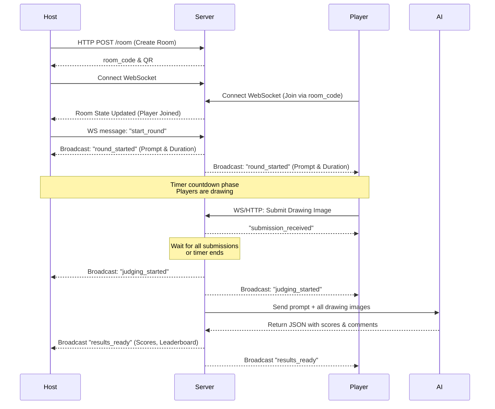

# Draw Judge Product Blueprint

## 1. Finalized Name
**Draw Judge** (Working Title: AI Judge Drawing Game)

## User Review Required
> [!IMPORTANT]
> Please review this blueprint, specifically the **API Contract Definitions** and the **MVP Backlog**, to ensure they align perfectly with your vision before we move into implementation.

## 2. User Flow Diagrams

### Core Game Loop


## 3. Screen-by-screen UI wireframe notes

### Screen 1: Landing Page
- **Primary Elements:** "Draw Judge" Logo, "Create Room" button, "Join Room" button (prompts for code).
- **Vibe:** Playful, high contrast, welcoming.

### Screen 2: Host Lobby
- **Primary Elements:** Huge Room Code text, QR Code for instant join.
- **Dynamic list:** Players populating as they join.
- **Controls:** "Start Game" button (enabled when at least 1 other player joins), Round settings (e.g., set to 3 rounds).

### Screen 3: Player Join & Lobby
- **Primary Elements:** Input for Display Name -> Submit.
- **Waiting Area:** "You're in! Waiting for Host to start..."
- **Display:** Shows list of everyone in the room.

### Screen 4: The Game Phase (Prompt Reveal & Drawing)
- **Top Bar:** The Prompt text front and center. A countdown timer (e.g., 60s).
- **Center:** The canvas. Tools: Pen, Eraser, Undo, Clear.
- **Bottom:** "Submit Drawing" button.
- **Action:** If timer hits 0, auto-submits current canvas state.

### Screen 5: AI Judging View
- **Interim Screen:** "The AI Judge is contemplating your art..." with a fun loading animation.
- **Purpose:** Keeps energy high while waiting for AI API latency (5-10 seconds).

### Screen 6: Results Screen
- **Format:** Carousel or Grid of drawings.
- **Each Card:** Drawing image, Player Name, AI Rating (Relevance/Creativity/Clarity/Fun), Total Score, AI Comment snippet.
- **Highlight:** Round Winner is clearly marked with a badge or confetti.

### Screen 7: Leaderboard & Next Round
- **View:** Cumulative scores from all rounds.
- **Host View:** Button to "Start Next Round".
- **Player View:** "Waiting for Host..." or "Game Over".

---

## 4. API Contract Definitions

### REST Endpoints
- `POST /api/rooms`
  - Creates a new game room session.
  - Returns: `{ "room_code": "ABCD", "qr_url": "...", "host_id": "uuid" }`
- `POST /api/rooms/{room_code}/submit`
  - Uploads a generated base64 drawing or form-data image to avoid heavy payload over WebSocket.
  - Returns: `{ "status": "success", "submission_id": "uuid" }`

### WebSocket Events (`/ws/rooms/{room_code}?player_id={id}&name={name}`)
- **Client to Server:**
  - `start_round`: Host triggers the next round.
  - `kick_player`: (Optional) Host removes a player.
- **Server to Client:**
  - `room_state_update`: Full active player list and room status (waiting/playing/judging).
  - `round_started`: Sends `{ "prompt": "Draw a cat", "duration_seconds": 60 }`.
  - `judging_started`: Signals UI to switch to loading/judging animation screen.
  - `results_ready`: Sends JSON payload with everyone's drawings, the AI scores, and the round winner.

---

## 5. AI Judging Prompt Spec

### System Prompt
```text
You are 'The Draw Judge', a playful, family-friendly, and slightly eccentric art critic for a multiplayer party game.

The drawing prompt was: "{PROMPT_TEXT}"
I am providing you with {N} drawing submissions.

For every submission, review the image and score it out of 10 on the following metrics:
1. prompt_relevance: Did the drawing match the prompt? (0-10)
2. creativity: Did they add a funny or original twist? (0-10)
3. clarity: Can you reasonably tell what it is? (0-10)
4. entertainment: Is it amusing, charming, or surprisingly good/bad? (0-10)

Your overall tone should be lighthearted, funny, and NEVER insulting or mean. Frame yourself as an enthusiastic judge. If a drawing is poor, find it charming or hilarious.

You MUST respond strictly in the following JSON schema:
{
  "results": [
    {
      "submission_id": "<provided_id>",
      "scores": {
        "prompt_relevance": 8,
        "creativity": 7,
        "clarity": 6,
        "entertainment": 9
      },
      "total_score": 30, // Sum of the above 4
      "comment": "A very creative interpretation! I love the goofy face, even if the legs are a bit wonky."
    }
  ]
}
```

---

## 6. MVP Backlog

### Phase 1: Foundation
1. Bootstrap FastAPI application with memory-based room state handling.
2. Bootstrap React frontend (Next.js or Vite).
3. Establish WebSocket connection manager for simple lobby chat/presence.

### Phase 2: Drawing Mechanics
1. Add HTML5 Canvas drawing component with smooth lines and basic tools (undo, clear).
2. Establish image upload endpoint / Base64 handling for final submission.

### Phase 3: Game Loop
1. Host flow: Create room, start round.
2. Server feature: Broadcast prompt and start server-side timer.
3. Client feature: Switch to drawing screen, lock canvas on timeout, auto-submit.

### Phase 4: AI & Resolution
1. Integrate Multimodal AI model (e.g., Gemini Flash/Pro) using the Judging Prompt Spec.
2. Build Results Screen UI mapping the JSON response to player cards.
3. Persistent session scoring (Leaderboard).

## Verification Plan
### Local Manual Verification
- Run a 3-player isolated test using standard browser windows.
- Ensure WebSocket handles disconnections smoothly (no crash).
- Verify AI API integration limits are respected, and handle timeouts gracefully.
